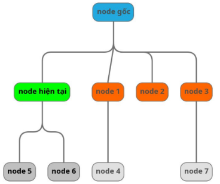

# GIT
## GIT STASH: 
- Lưu vào 1 bộ nhớ tạm và lấy ra khi cần:

        Câu lệnh stash: git stash
        Câu lệnh unstash: git stash pop

# DOM 
## Visualize

## Quy ước

## Relation
- Self: node hiện tại
- Parent: Cha (là node phía trên trực tiếp của node hiện tại) 

    

- Children: Con (là node phía dưới trực tiếp của node hiện tại)

    

- Ancestor: Tổ tiên (Là các node phía trên của các node khác)

    

- Descendant: Con cháu (Là các node con, cháu, chắt,...)

    

- Sibling: Anh em (Là các node có cùng cấp và cùng cha)

    

- Following: Theo sau (Là các node ở phía bên phải của node hiện tại, dưới hình là các node màu cam)
    - Ko bao gồm node cha và node con của node hiện tại

    

- Preceding: Phía trước (Là các node ở phía bên trái của node hiện tại, trừ các node ancestor, dưới hình là các node màu cam )
    - Bao gồm tất cả các thẻ đằng trước k bao gồm nốt cha và tổ tiên

    

- Following-sibling: Anh em phía sau

    

- Preceding-sibling: Anh em phía trước

    

# XPath 
## Advance methods
- wildcard: *

        //*[class="form-group"]

- chứa thuộc tính: 

        //input[@checked]
- and và or:

        //input[@type="email" and/or @name="email"]
- innerText: text()

        //h1[text() = "User Registration"]
- Element as attribute

        
- normalize-space()

        //h1[normalize-space() = "User Registration."]
- contains

        //h1[contain(text(), "User Registration at")]
- starts-with

        //h1[starts-with(text(), "User Registration at")]
- ends-with

        //h1[ends-with(text(), "Registration.")]
- not

        //h1[not(starts-with(text(), "User Registration at"))]

## Axes
- parent 

        //input[@id = "username"]/parent::*
- child 

        //div[@id = "parent"]/child::input
- ancestor 

        //div[@id = "parent"]/ancestor::*
- descendant 

        //form[@id = "registrationForm"]/descendant::input 
- sibling 

- following 

        //form[@id = "registrationForm"]/following::*
- preceding 

        //form[@id = "registrationForm"]/preceding::*
- following-sibling 

        //form[@id = "registrationForm"]/following-sibling::*
- preceding-sibling

        //form[@id = "registrationForm"]/preceding-sibling::*